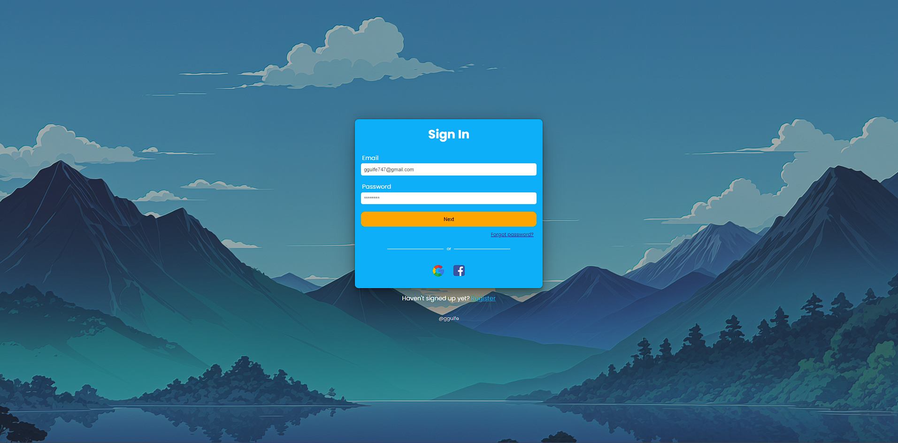

<h1 align="center" style="font-weight: bold;">Authentication System 💻</h1>

<div align="center">
  
</div>

<p align="center">
 <a href="#tech">Technologies</a> • 
 <a href="#started">Getting Started</a> • 
  <a href="#routes">API Endpoints</a> •
 <a href="#colab">Collaborators</a>
</p>

<p align="center">
    <b>This project is a user authentication system focused on ensuring security through password encryption and protection against brute force attacks. It allows for the secure and efficient creation, update, deletion, and authentication of users.</b>
</p>

<h2 id="technologies">💻 Technologies</h2>

- NodeJS
- MySQL
- Sequelize
- Typescript
- Docker compose

<h2 id="started">🚀 Getting started</h2>

Here is a step-by-step guide to run your project locally.

<h3>Prerequisites</h3>

Make sure you have the following software installed on your system:

- [NodeJS](https://nodejs.org/en)
- [Docker](https://www.docker.com/products/docker-desktop)
- [Docker Compose](https://docs.docker.com/compose/install/)

<h3>Cloning</h3>

```bash
git clone https://github.com/Gguife/system_auth
```

<h3>Config .env variables</h2>

Use the `.env.example` as reference to create your configuration file `.env` 

```yaml
DB_USER=Database_user_name
DB_NAME=Database_name
DB_PASSWORD=Database_password
DB_HOST=localhost
DB_PORT=3306

NODE_ENV=development
```

<h3>Starting</h3>

How to start project

```bash
1. npm install or yarn install
2. docker-compose up -d
3. npx sequelize db:migrate
4. yarn sequelize db:migrate
```

<h2 id="routes">📍 API Endpoints</h2>

​
| route               | Model     | Description                                     
|----------------------|-----------------------------|------------------------
| <kbd>GET /users</kbd>     | <strong>users</strong>    | See all users
| <kbd>GET /account/:id</kbd>     | <strong>users</strong>    | See user by their id
| <kbd>POST /account/create</kbd>    | <strong>users</strong>    | Create user
| <kbd>PUT /account/update/:id</kbd> | <strong>users</strong>    | Update user
| <kbd>DELETE /account/remove/:id</kbd> | <strong>users</strong>    | Remove user
| <kbd>POST /login</kbd>    | <strong>users</strong>    | Account access


<h2 id="colab">🤝 Collaborators</h2>


  <a href="#">
    <br>
    <sub>
      <b>Guilherme Gomes</b>
    </sub>
  </a>
